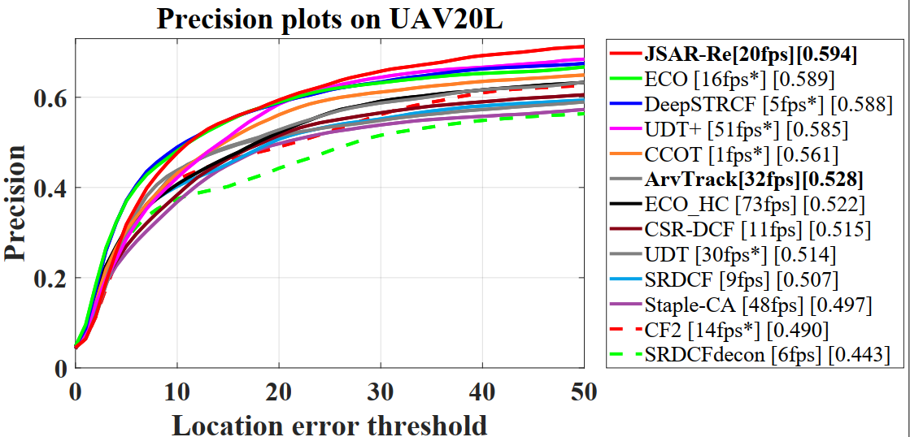

# Automatic Failure Recovery and Re-Initialization for Online UAV Tracking with Joint Scale and Aspect Ratio Optimization  
This is the Matlab implementation of our joint scale and aspect ratio optimization tracker (JSAR) and JSAR-Re which adds novel re-detection strategy in JSAR.

# Abstract

Current unmanned aerial vehicle (UAV) visual tracking algorithms are primarily limited with respect to: (i) the kind of size variation they can deal with, (ii) the implementation speed which hardly meets the real-time requirement. In this work, a real-time UAV tracking algorithm with powerful size estimation ability is proposed. Specifically, the overall tracking task is allocated to two 2D filters: (i) translation filter forlocation prediction in the space domain, (ii) size filter for scale and aspect ratio optimization in the size domain. Besides, an efficient two-stage re-detection strategy is introduced for long-term UAV tracking tasks. Large-scale experiments on four UAV benchmarks demonstrate the superiority of the presented method which has computation feasibility on a low-cost CPU.

# Publication

 JSAR and JSAR-Re are proposed in our paper accepted by IROS 2020. Detailed explanation of our method can be found in the paper:

Fangqiang Ding, Changhong Fu, Yiming Li, Jin Jin and Chen Feng.

Automatic Failure Recovery and Re-Initialization for Online UAV Tracking with Joint Scale and Aspect Ratio Optimization 

https://arxiv.org/abs/2008.03915

# Contact

Fangqiang Ding

Email: dfq.toytiny@gmail.com

Changhong Fu

Email: [changhong.fu@tongji.edu.cn](mailto:changhong.fu@tongji.edu.cn)

# Demonstration running instructions

This code is compatible with UAV123@10fps, DTB70, UAVDT and UAV20L benchmark. Therefore, if you want to run it in benchmark, just put JSAR folder in trackers,  and config sequences and trackers (JSAR or JSAR-Re) according to instructions from aforementioned benchmarks. 

# Results on UAV datasets

### UAV123@10fps

### UAVDT

### DTB70

### UAV20L

# Acknowledgements

We thank the contribution of  Feng Li and Ning Wang for their previous work STRCF and  MCCT-H.  The feature extraction modules and some of the parameter are borrowed from the MCCT tracker (https://github.com/594422814/MCCT). 
